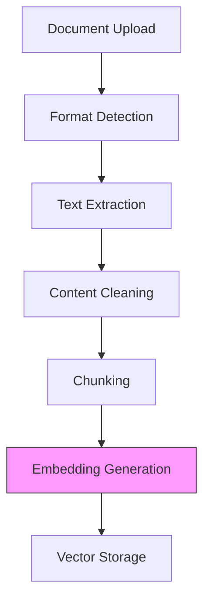

# Document Processing

CloudIndex's document processing pipeline efficiently converts various document formats into searchable vector embeddings while preserving document structure and relationships.

## Processing Pipeline



## Supported Formats

### Document Types
- PDF (`.pdf`)
- Microsoft Word (`.docx`, `.doc`)
- Markdown (`.md`, `.mdx`)
- Plain Text (`.txt`)
- Source Code (multiple languages)
- Web Content (HTML)

### Format-Specific Processing

#### PDF Processing
- OCR for scanned documents
- Table extraction
- Image handling
- Layout preservation
- Metadata extraction

#### Word Documents
- Style preservation
- Table handling
- Image extraction
- Track changes support
- Comments handling

#### Markdown/MDX
- Front matter parsing
- Code block handling
- Link resolution
- Image references
- Custom components

#### Source Code
- Syntax awareness
- Comment handling
- Function detection
- Variable tracking
- Dependencies

## Processing Steps

### 1. Format Detection
```python
# Example format detection response
{
  "type": "pdf",
  "version": "1.7",
  "encrypted": false,
  "pageCount": 10,
  "metadata": {
    "author": "John Doe",
    "created": "2024-01-22T12:00:00Z"
  }
}
```

### 2. Text Extraction
- Format-specific extractors
- Character encoding handling
- Language detection
- Layout analysis
- Structure preservation

### 3. Content Cleaning
- Remove redundant whitespace
- Fix character encodings
- Normalize line endings
- Handle special characters
- Maintain semantic structure

### 4. Chunking
```python
# Example chunking configuration
{
  "strategy": "semantic",
  "chunk_size": 1000,
  "overlap": 200,
  "respect_boundaries": true,
  "preserve_formatting": true
}
```

### 5. Embedding Generation
```python
# Example embedding request
{
  "model": "text-embedding-ada-002",
  "chunks": ["..."],
  "options": {
    "normalize": true,
    "batch_size": 100
  }
}
```

## Configuration Options

### Processing Options
```javascript
const options = {
  ocr: {
    enabled: true,
    language: 'auto',
    quality: 'high'
  },
  chunking: {
    method: 'semantic',
    size: 1000,
    overlap: 200
  },
  embeddings: {
    model: 'text-embedding-ada-002',
    dimensions: 1536
  },
  metadata: {
    extract: true,
    custom: {
      department: 'Engineering',
      category: 'Technical'
    }
  }
};
```

## Best Practices

### Document Preparation
1. **Clean Source Documents**
   - Use consistent formatting
   - Remove unnecessary content
   - Update outdated information
   - Fix broken references

2. **Metadata Management**
   - Include descriptive titles
   - Add relevant tags
   - Specify document owners
   - Set access permissions

3. **Version Control**
   - Track document versions
   - Document changes
   - Maintain history
   - Handle conflicts

### Processing Optimization
1. **Chunking Strategy**
   - Consider document structure
   - Balance chunk size
   - Test different overlaps
   - Monitor performance

2. **Resource Management**
   - Batch large uploads
   - Schedule processing
   - Monitor memory usage
   - Handle timeouts

3. **Quality Control**
   - Validate outputs
   - Check embeddings
   - Test search quality
   - Monitor errors

## Error Handling

### Common Issues
1. **Format Issues**
   - Corrupted files
   - Unsupported formats
   - Encryption problems
   - Missing dependencies

2. **Processing Errors**
   - OCR failures
   - Extraction errors
   - Memory limits
   - Timeout issues

3. **Content Problems**
   - Invalid characters
   - Broken structure
   - Missing references
   - Incomplete content

## Next Steps

- [Vector Operations](/docs/core-concepts/vector-operations)
- [Reranking System](/docs/core-concepts/reranking)
- [Document Upload Guide](/docs/guides/document-upload)
- [Batch Processing](/docs/guides/batch-processing)
