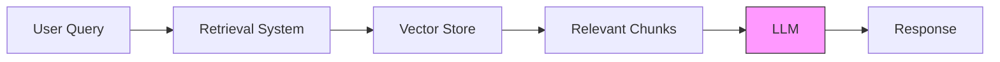

# Retrieval-Augmented Generation (RAG)

Retrieval-Augmented Generation (RAG) is a powerful approach that enhances Large Language Models (LLMs) by providing them with relevant context from your documents.

## What is RAG?

RAG combines two key capabilities:
1. **Retrieval**: Finding relevant information from your document collection
2. **Generation**: Using that information to generate accurate, contextual responses



## How CloudIndex Implements RAG

### 1. Document Processing
- Documents are chunked into semantic units
- Each chunk is converted to a vector embedding
- Metadata and relationships are preserved
- Versions are tracked for consistency

### 2. Vector Storage
- High-performance vector database
- Efficient similarity search
- Automatic index optimization
- Scalable architecture

### 3. Retrieval System
- Hybrid search combining:
  - Vector similarity
  - Keyword matching
  - Metadata filtering
- Real-time reranking
- Relevance tuning

### 4. Generation
- Multiple LLM options
- Context window optimization
- Source attribution
- Response streaming

## Key Components

### Document Chunking
```python
# Example chunking configuration
{
  "chunk_size": 1000,
  "chunk_overlap": 200,
  "split_method": "semantic",
  "preserve_markdown": true
}
```

### Vector Embeddings
```python
# Example embedding generation
{
  "model": "text-embedding-ada-002",
  "dimensions": 1536,
  "normalize": true
}
```

### Search Configuration
```python
# Example search parameters
{
  "hybrid_search": {
    "vector_weight": 0.7,
    "keyword_weight": 0.3,
    "reranking": true
  }
}
```

## Benefits of RAG

1. **Improved Accuracy**
   - Grounded in your documents
   - Reduced hallucination
   - Verifiable responses

2. **Up-to-date Information**
   - Real-time document updates
   - No training required
   - Always current context

3. **Cost Effective**
   - Smaller context windows
   - Efficient retrieval
   - Optimized token usage

4. **Enhanced Control**
   - Source tracking
   - Relevance tuning
   - Response filtering

## Best Practices

### Document Preparation
- Use clear document structure
- Include metadata
- Maintain versions
- Regular updates

### Retrieval Optimization
- Tune chunk sizes
- Adjust search weights
- Configure reranking
- Monitor performance

### Response Generation
- Set clear instructions
- Implement fallbacks
- Handle edge cases
- Validate outputs

## Next Steps

- [Document Processing](/docs/core-concepts/document-processing)
- [Vector Operations](/docs/core-concepts/vector-operations)
- [Reranking System](/docs/core-concepts/reranking)
- [Implementation Guides](/docs/guides/document-upload)
