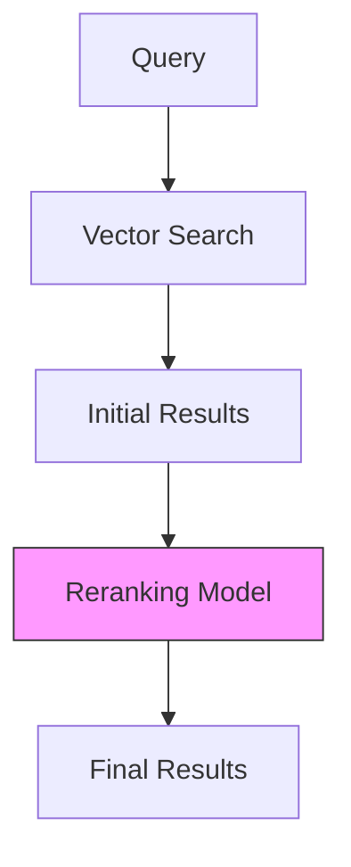

# Reranking System

CloudIndex uses Cohere's reranking system to improve search result relevance by reordering initial vector search results based on semantic understanding.

## What is Reranking?

Reranking is a two-stage process:
1. Initial retrieval using vector search
2. Result refinement using advanced semantic models



## How Reranking Works

### 1. Initial Retrieval
- Vector similarity search
- Keyword matching
- Metadata filtering
- Returns top-k results

### 2. Reranking Process
- Advanced semantic analysis
- Cross-attention mechanisms
- Context understanding
- Score recalculation

## Configuration Options

### Basic Configuration
```javascript
const rerankConfig = {
  enabled: true,
  model: "rerank-english-v2.0",
  topK: 50,
  threshold: 0.7
};
```

### Advanced Settings
```javascript
const advancedConfig = {
  reranking: {
    model: "rerank-multilingual-v2.0",
    topK: 100,
    threshold: 0.7,
    options: {
      truncation: "LEFT",
      maxLength: 512,
      temperature: 0.7
    },
    weights: {
      semantic: 0.7,
      lexical: 0.3
    }
  }
};
```

## Reranking Models

### Available Models

1. **English Models**
   - rerank-english-v2.0 (default)
   - rerank-english-v3.0
   - rerank-english-light

2. **Multilingual Models**
   - rerank-multilingual-v2.0
   - rerank-multilingual-v3.0

3. **Domain-Specific Models**
   - rerank-financial
   - rerank-medical
   - rerank-legal

## Performance Impact

### Benefits
1. **Improved Relevance**
   - Better semantic matching
   - Context understanding
   - Query intent alignment

2. **Reduced Noise**
   - Filter irrelevant results
   - Handle ambiguity
   - Remove duplicates

### Considerations
1. **Latency**
   - Additional processing time
   - Batch processing overhead
   - Network requests

2. **Cost**
   - API usage
   - Model complexity
   - Result volume

## Usage Examples

### Basic Search with Reranking
```javascript
const search = {
  query: "cloud architecture best practices",
  reranking: {
    enabled: true,
    topK: 20
  }
};
```

### Advanced Search Configuration
```javascript
const advancedSearch = {
  query: "cloud architecture best practices",
  reranking: {
    enabled: true,
    model: "rerank-english-v2.0",
    topK: 50,
    threshold: 0.7,
    options: {
      truncation: "LEFT",
      maxLength: 512
    }
  },
  filter: {
    type: "technical",
    date: {
      $gte: "2024-01-01"
    }
  }
};
```

## Optimization Strategies

### Result Quality
1. **Top-K Tuning**
   ```javascript
   const qualityConfig = {
     initialResults: 100,
     rerankTop: 50,
     minScore: 0.7
   };
   ```

2. **Threshold Adjustment**
   ```javascript
   const thresholdConfig = {
     semantic: 0.7,
     lexical: 0.3,
     combined: 0.6
   };
   ```

### Performance Tuning
1. **Batch Processing**
   ```javascript
   const batchConfig = {
     maxBatchSize: 50,
     concurrency: 3,
     timeout: 5000
   };
   ```

2. **Caching Strategy**
   ```javascript
   const cacheConfig = {
     enabled: true,
     ttl: 3600,
     maxSize: "500mb"
   };
   ```

## Best Practices

### Configuration
1. **Model Selection**
   - Choose appropriate model
   - Consider language needs
   - Balance quality vs speed

2. **Parameter Tuning**
   - Adjust top-k values
   - Set score thresholds
   - Configure weights

### Implementation
1. **Error Handling**
   ```javascript
   try {
     const results = await search.withReranking(query);
   } catch (error) {
     // Fallback to basic search
     const results = await search.basic(query);
   }
   ```

2. **Monitoring**
   ```javascript
   const metrics = {
     latency: {
       initial: 50,  // ms
       reranking: 200  // ms
     },
     quality: {
       improvement: 0.3,  // 30%
       relevance: 0.85
     }
   };
   ```

## Next Steps

- [Document Upload Guide](/docs/guides/document-upload)
- [Error Handling](/docs/guides/error-handling)
- [Monitoring Guide](/docs/guides/monitoring)
- [API Reference](/api-reference/introduction)
