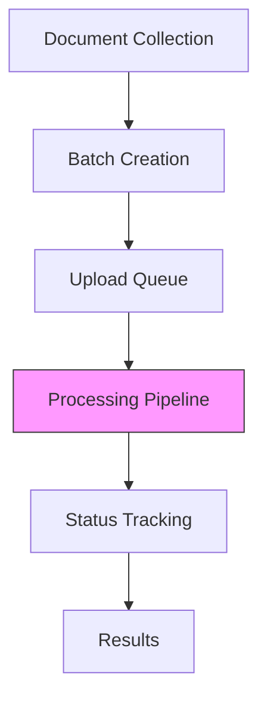

# Working with Batch Uploads

Learn how to efficiently process large volumes of documents using CloudIndex's batch processing capabilities.

## Batch Processing Overview



## Implementation Guide

### Batch Configuration

```javascript
const batchConfig = {
  // Processing settings
  processing: {
    concurrency: 5,
    chunkSize: 1000,
    retryAttempts: 3,
    timeout: 300000 // 5 minutes
  },
  
  // Resource limits
  limits: {
    maxBatchSize: 1000,
    maxFileSize: 100 * 1024 * 1024, // 100MB
    totalBatchBytes: 1024 * 1024 * 1024 // 1GB
  },
  
  // Progress tracking
  tracking: {
    enabled: true,
    webhookUrl: 'https://your-server.com/webhook',
    statusInterval: 5000 // 5 seconds
  }
};
```

## Batch Upload Implementation

### Basic Batch Upload

```javascript
import { CloudIndex } from '@cloudindex/sdk';

const cloudindex = new CloudIndex({ apiKey: 'your_api_key' });

async function uploadBatch(files) {
  const batch = await cloudindex.batches.create({
    name: 'Document Batch 1',
    description: 'Technical documentation batch upload'
  });

  const results = await cloudindex.documents.uploadBatch(files, {
    batchId: batch.id,
    onProgress: (progress) => {
      console.log(`Progress: ${progress.completed}/${progress.total}`);
    }
  });

  return results;
}
```

### Advanced Batch Processing

```javascript
async function processLargeBatch(directory) {
  // Create batch processor
  const processor = new cloudindex.BatchProcessor({
    concurrency: 5,
    batchSize: 100,
    retryAttempts: 3,
    
    // Progress callbacks
    onBatchStart: (batchNumber, files) => {
      console.log(`Starting batch ${batchNumber} with ${files.length} files`);
    },
    onBatchComplete: (batchNumber, results) => {
      console.log(`Completed batch ${batchNumber}`);
    },
    onFileProgress: (file, progress) => {
      console.log(`${file.name}: ${progress}%`);
    }
  });

  // Process directory
  const results = await processor.processDirectory(directory);
  return results;
}
```

## Progress Tracking

### Status Monitoring

```javascript
async function monitorBatchProgress(batchId) {
  const status = await cloudindex.batches.getStatus(batchId);
  
  console.log({
    batchId,
    progress: {
      total: status.totalFiles,
      processed: status.processedFiles,
      failed: status.failedFiles,
      percentage: status.progressPercentage
    },
    timing: {
      started: status.startedAt,
      estimated: status.estimatedCompletion
    }
  });
}
```

### Webhook Integration

```javascript
// Server-side webhook handler
app.post('/webhook', (req, res) => {
  const { 
    batchId, 
    status, 
    completedFiles, 
    totalFiles,
    errors 
  } = req.body;

  // Update your application state
  updateBatchStatus(batchId, {
    status,
    progress: (completedFiles / totalFiles) * 100,
    errors
  });

  res.sendStatus(200);
});
```

## Error Handling

### Batch Level Error Handling

```javascript
async function handleBatchErrors(batchId) {
  const errors = await cloudindex.batches.getErrors(batchId);
  
  // Group errors by type
  const errorGroups = errors.reduce((groups, error) => {
    const group = groups[error.type] || [];
    group.push(error);
    groups[error.type] = group;
    return groups;
  }, {});

  // Handle different error types
  for (const [type, errors] of Object.entries(errorGroups)) {
    switch (type) {
      case 'validation':
        await handleValidationErrors(errors);
        break;
      case 'processing':
        await retryProcessingErrors(errors);
        break;
      case 'system':
        await escalateSystemErrors(errors);
        break;
    }
  }
}
```

### Retry Strategies

```javascript
const retryStrategy = {
  maxAttempts: 3,
  backoff: {
    initial: 1000,
    multiplier: 2,
    maxDelay: 30000
  },
  conditions: {
    retryable: [
      'rate_limit_exceeded',
      'temporary_error',
      'connection_error'
    ],
    fatal: [
      'invalid_file',
      'unauthorized',
      'quota_exceeded'
    ]
  }
};
```

## Performance Optimization

### Resource Management

```javascript
const resourceConfig = {
  memory: {
    maxBufferSize: '1GB',
    clearInterval: 1000
  },
  network: {
    maxConcurrent: 5,
    timeout: 30000
  },
  processing: {
    maxWorkers: 3,
    queueSize: 1000
  }
};
```

### Batch Splitting

```javascript
function optimizeBatchSize(files) {
  const batches = [];
  let currentBatch = [];
  let currentSize = 0;
  
  for (const file of files) {
    if (currentSize + file.size > MAX_BATCH_SIZE) {
      batches.push(currentBatch);
      currentBatch = [];
      currentSize = 0;
    }
    
    currentBatch.push(file);
    currentSize += file.size;
  }
  
  if (currentBatch.length > 0) {
    batches.push(currentBatch);
  }
  
  return batches;
}
```

## Best Practices

1. **Preparation**
   - Validate files before batch creation
   - Group similar documents together
   - Prepare metadata in advance
   - Check total batch size

2. **Processing**
   - Monitor resource usage
   - Implement proper error handling
   - Use appropriate concurrency
   - Track progress consistently

3. **Verification**
   - Check processed documents
   - Verify vector embeddings
   - Test search functionality
   - Monitor error rates

## Next Steps

- [Error Handling Guide](/docs/guides/error-handling)
- [Monitoring Guide](/docs/guides/monitoring)
- [Vector Operations](/docs/core-concepts/vector-operations)
- [API Reference](/api-reference/introduction)
