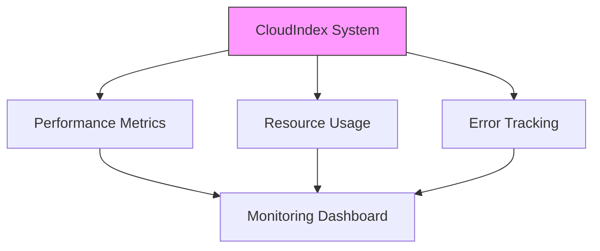

# System Monitoring and Metrics

Learn how to monitor your CloudIndex implementation, track performance metrics, and set up alerts.

## Monitoring Overview



## Key Metrics

### System Health

```javascript
const systemMetrics = {
  availability: {
    uptime: 99.99,
    lastDowntime: '2024-01-21T00:00:00Z',
    incidents: []
  },
  latency: {
    p50: 150,  // ms
    p95: 450,  // ms
    p99: 800   // ms
  },
  throughput: {
    requestsPerSecond: 100,
    documentsProcessed: 5000,
    vectorsGenerated: 150000
  }
};
```

### Resource Usage

```javascript
const resourceMetrics = {
  storage: {
    total: '100GB',
    used: '65GB',
    available: '35GB'
  },
  memory: {
    total: '16GB',
    used: '12GB',
    available: '4GB'
  },
  cpu: {
    usage: 65,        // percentage
    cores: 8,
    load: [2.5, 2.1, 1.8]
  }
};
```

## Monitoring Implementation

### Performance Monitoring

```javascript
class PerformanceMonitor {
  constructor(options = {}) {
    this.metrics = new Map();
    this.interval = options.interval || 60000;
    this.retention = options.retention || 86400000;
  }

  trackOperation(name, duration, status) {
    const metric = this.metrics.get(name) || {
      count: 0,
      totalDuration: 0,
      errors: 0,
      durations: []
    };

    metric.count++;
    metric.totalDuration += duration;
    if (status === 'error') metric.errors++;
    metric.durations.push(duration);

    this.metrics.set(name, metric);
  }

  getMetrics(operation) {
    const metric = this.metrics.get(operation);
    if (!metric) return null;

    const durations = metric.durations.sort((a, b) => a - b);
    return {
      count: metric.count,
      avgDuration: metric.totalDuration / metric.count,
      errorRate: metric.errors / metric.count,
      p50: durations[Math.floor(durations.length * 0.5)],
      p95: durations[Math.floor(durations.length * 0.95)],
      p99: durations[Math.floor(durations.length * 0.99)]
    };
  }
}
```

### Resource Monitoring

```javascript
class ResourceMonitor {
  constructor() {
    this.metrics = {
      vector: {
        total: 0,
        indexed: 0,
        pending: 0
      },
      storage: {
        used: 0,
        available: 0
      },
      processing: {
        active: 0,
        queued: 0
      }
    };
  }

  async collectMetrics() {
    const metrics = await Promise.all([
      this.getVectorMetrics(),
      this.getStorageMetrics(),
      this.getProcessingMetrics()
    ]);

    return {
      timestamp: new Date().toISOString(),
      metrics: {
        vector: metrics[0],
        storage: metrics[1],
        processing: metrics[2]
      }
    };
  }

  async getVectorMetrics() {
    const stats = await cloudindex.vectors.getStats();
    return {
      total: stats.totalVectors,
      indexed: stats.indexedVectors,
      pending: stats.pendingVectors
    };
  }
}
```

## Alert Configuration

### Alert Rules

```javascript
const alertRules = {
  system: {
    highLatency: {
      threshold: 1000,  // ms
      window: '5m',
      condition: 'p95 > threshold'
    },
    errorRate: {
      threshold: 0.01,  // 1%
      window: '15m',
      condition: 'rate > threshold'
    }
  },
  resources: {
    storage: {
      threshold: 0.9,  // 90% usage
      window: '1h',
      condition: 'usage > threshold'
    },
    processing: {
      queueSize: {
        threshold: 1000,
        window: '10m',
        condition: 'size > threshold'
      }
    }
  }
};
```

### Alert Implementation

```javascript
class AlertManager {
  constructor(rules) {
    this.rules = rules;
    this.alerts = new Map();
    this.handlers = new Map();
  }

  async checkAlerts(metrics) {
    for (const [name, rule] of Object.entries(this.rules)) {
      const triggered = await this.evaluateRule(rule, metrics);
      
      if (triggered) {
        await this.triggerAlert(name, {
          timestamp: new Date().toISOString(),
          rule: name,
          metrics: metrics,
          threshold: rule.threshold
        });
      }
    }
  }

  async triggerAlert(name, data) {
    const alert = {
      id: uuid(),
      name,
      ...data
    };

    this.alerts.set(alert.id, alert);
    
    const handler = this.handlers.get(name);
    if (handler) {
      await handler(alert);
    }
  }
}
```

## Dashboard Integration

### Metrics Dashboard

```javascript
const dashboardConfig = {
  refresh: 60,  // seconds
  panels: [
    {
      title: 'System Health',
      type: 'status',
      metrics: ['uptime', 'latency', 'errors']
    },
    {
      title: 'Processing Pipeline',
      type: 'graph',
      metrics: ['throughput', 'queue_size', 'processing_time']
    },
    {
      title: 'Resource Usage',
      type: 'gauge',
      metrics: ['storage', 'memory', 'cpu']
    }
  ]
};
```

### Metrics Collection

```javascript
class MetricsCollector {
  constructor(options = {}) {
    this.interval = options.interval || 60000;
    this.metrics = [];
  }

  async collect() {
    const metrics = await Promise.all([
      this.collectSystemMetrics(),
      this.collectResourceMetrics(),
      this.collectProcessingMetrics()
    ]);

    this.metrics.push({
      timestamp: new Date().toISOString(),
      system: metrics[0],
      resources: metrics[1],
      processing: metrics[2]
    });

    // Cleanup old metrics
    this.cleanup();
  }

  async exportMetrics(format = 'json') {
    switch (format) {
      case 'json':
        return JSON.stringify(this.metrics);
      case 'prometheus':
        return this.toPrometheusFormat();
      default:
        throw new Error(`Unsupported format: ${format}`);
    }
  }
}
```

## Best Practices

1. **Metric Collection**
   - Regular intervals
   - Appropriate granularity
   - Efficient storage
   - Data retention policy

2. **Alert Configuration**
   - Clear thresholds
   - Avoid alert fatigue
   - Proper escalation
   - Alert correlation

3. **Dashboard Design**
   - Key metrics visible
   - Logical grouping
   - Clear visualization
   - Real-time updates

## Next Steps

- [Error Handling Guide](/docs/guides/error-handling)
- [Batch Processing](/docs/guides/batch-processing)
- [API Reference](/api-reference/introduction)
- [System Architecture](/docs/core-concepts/rag-overview)
