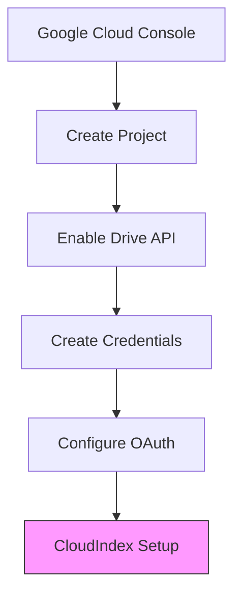

# Google Drive Integration

Learn how to integrate CloudIndex with Google Drive to automatically process and index documents from your Drive folders.

## Setup Overview



## Prerequisites

1. **Google Cloud Project**
   - Google Cloud account
   - Project with Drive API enabled
   - OAuth 2.0 credentials

2. **CloudIndex Configuration**
   - CloudIndex API key
   - Admin access to your project
   - Webhook endpoint (optional)

## Google Cloud Setup

### 1. Create Credentials

1. Go to [Google Cloud Console](https://console.cloud.google.com)
2. Create a new project or select existing
3. Enable the Google Drive API
4. Create OAuth 2.0 credentials:
   ```json
   {
     "client_id": "your-client-id.apps.googleusercontent.com",
     "client_secret": "your-client-secret",
     "redirect_uris": ["https://your-app.com/oauth/callback"]
   }
   ```

### 2. Configure OAuth Consent Screen

```javascript
const oauthConfig = {
  application_name: "CloudIndex Integration",
  scopes: [
    "https://www.googleapis.com/auth/drive.readonly",
    "https://www.googleapis.com/auth/drive.metadata.readonly"
  ],
  access_type: "offline",
  prompt: "consent"
};
```

## CloudIndex Integration

### 1. Configure Integration

```javascript
import { CloudIndex } from '@cloudindex/sdk';

const cloudindex = new CloudIndex({ apiKey: 'your_api_key' });

await cloudindex.integrations.configure({
  type: 'google_drive',
  credentials: {
    clientId: process.env.GOOGLE_CLIENT_ID,
    clientSecret: process.env.GOOGLE_CLIENT_SECRET,
    redirectUri: process.env.OAUTH_REDIRECT_URI
  },
  settings: {
    syncInterval: 3600,  // 1 hour
    fileTypes: ['pdf', 'docx', 'txt'],
    maxFileSize: 100 * 1024 * 1024  // 100MB
  }
});
```

### 2. OAuth Flow Implementation

```javascript
// Initialize OAuth client
const oauth2Client = new google.auth.OAuth2(
  process.env.GOOGLE_CLIENT_ID,
  process.env.GOOGLE_CLIENT_SECRET,
  process.env.OAUTH_REDIRECT_URI
);

// Generate authorization URL
function getAuthUrl() {
  return oauth2Client.generateAuthUrl({
    access_type: 'offline',
    scope: [
      'https://www.googleapis.com/auth/drive.readonly',
      'https://www.googleapis.com/auth/drive.metadata.readonly'
    ]
  });
}

// Handle OAuth callback
async function handleCallback(code) {
  const { tokens } = await oauth2Client.getToken(code);
  await cloudindex.integrations.updateCredentials('google_drive', {
    accessToken: tokens.access_token,
    refreshToken: tokens.refresh_token,
    expiry: tokens.expiry_date
  });
}
```

## Document Sync

### 1. Configure Sync Settings

```javascript
const syncConfig = {
  folders: [
    {
      id: "folder_id_1",
      recursive: true,
      fileTypes: ["pdf", "docx"],
      excludePatterns: ["*draft*", "*temp*"]
    }
  ],
  schedule: {
    interval: "1h",
    maxConcurrent: 5
  },
  processing: {
    extractText: true,
    generatePreviews: true,
    preserveFormatting: true
  }
};
```

### 2. Implement Sync Logic

```javascript
class DriveSync {
  constructor(config) {
    this.config = config;
    this.drive = google.drive({ version: 'v3', auth: oauth2Client });
  }

  async syncFolder(folderId) {
    const files = await this.listFiles(folderId);
    
    for (const file of files) {
      if (this.shouldProcessFile(file)) {
        await this.processFile(file);
      }
    }
  }

  async processFile(file) {
    const stream = await this.drive.files.get(
      { fileId: file.id, alt: 'media' },
      { responseType: 'stream' }
    );

    await cloudindex.documents.upload({
      file: stream,
      metadata: {
        source: 'google_drive',
        driveFileId: file.id,
        driveFolderId: file.parents[0],
        lastModified: file.modifiedTime
      }
    });
  }
}
```

## Change Tracking

### 1. Watch for Changes

```javascript
async function watchDriveChanges() {
  const pageToken = await getStoredPageToken();
  
  const response = await drive.changes.list({
    pageToken,
    spaces: 'drive',
    includeItemsFromAllDrives: false,
    restrictToMyDrive: true
  });

  for (const change of response.data.changes) {
    await handleDriveChange(change);
  }

  await storePageToken(response.data.newStartPageToken);
}
```

### 2. Handle Changes

```javascript
async function handleDriveChange(change) {
  if (change.removed || change.file.trashed) {
    // Handle deletion
    await cloudindex.documents.delete({
      metadata: {
        driveFileId: change.fileId
      }
    });
  } else {
    // Handle update
    await processFile(change.file);
  }
}
```

## Error Handling

### 1. Common Issues

```javascript
class DriveIntegrationError extends Error {
  constructor(code, message, details) {
    super(message);
    this.code = code;
    this.details = details;
  }
}

async function handleDriveError(error) {
  switch (error.code) {
    case 401:
      await refreshTokens();
      break;
    case 403:
      await handlePermissionError(error);
      break;
    case 404:
      await handleMissingFile(error);
      break;
    default:
      throw new DriveIntegrationError(
        'drive_error',
        'Google Drive operation failed',
        error
      );
  }
}
```

### 2. Token Refresh

```javascript
async function refreshTokens() {
  try {
    const tokens = await oauth2Client.refreshToken(
      storedCredentials.refreshToken
    );
    
    await cloudindex.integrations.updateCredentials('google_drive', {
      accessToken: tokens.access_token,
      expiry: tokens.expiry_date
    });
  } catch (error) {
    throw new DriveIntegrationError(
      'refresh_failed',
      'Failed to refresh access token',
      error
    );
  }
}
```

## Best Practices

1. **Security**
   - Store credentials securely
   - Use minimal scopes
   - Implement token rotation
   - Monitor access patterns

2. **Performance**
   - Batch operations
   - Implement rate limiting
   - Use change notifications
   - Cache file metadata

3. **Reliability**
   - Handle token expiration
   - Implement retry logic
   - Monitor sync status
   - Log operations

## Next Steps

- [S3 Integration](/docs/integrations/s3-bucket)
- [Slack Integration](/docs/integrations/slack)
- [Error Handling](/docs/guides/error-handling)
- [Monitoring Guide](/docs/guides/monitoring)
