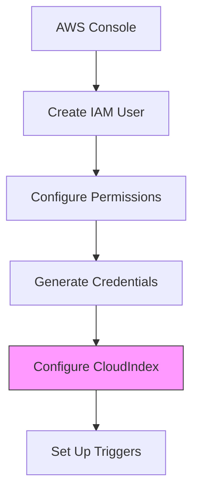

# AWS S3 Integration

Learn how to integrate CloudIndex with Amazon S3 to automatically process and index documents from your buckets.

## Setup Overview



## Prerequisites

1. **AWS Account**
   - AWS account with S3 access
   - IAM permissions to create users
   - S3 bucket with documents

2. **CloudIndex Configuration**
   - CloudIndex API key
   - Admin access to your project
   - Webhook endpoint (optional)

## AWS Setup

### 1. IAM Policy

Create an IAM policy with the minimum required permissions:

```json
{
  "Version": "2012-10-17",
  "Statement": [
    {
      "Effect": "Allow",
      "Action": [
        "s3:GetObject",
        "s3:ListBucket",
        "s3:GetBucketNotification",
        "s3:PutBucketNotification"
      ],
      "Resource": [
        "arn:aws:s3:::your-bucket-name",
        "arn:aws:s3:::your-bucket-name/*"
      ]
    }
  ]
}
```

### 2. Configure AWS Credentials

```javascript
const awsConfig = {
  credentials: {
    accessKeyId: process.env.AWS_ACCESS_KEY_ID,
    secretAccessKey: process.env.AWS_SECRET_ACCESS_KEY
  },
  region: process.env.AWS_REGION,
  bucket: process.env.S3_BUCKET_NAME
};
```

## CloudIndex Integration

### 1. Configure Integration

```javascript
import { CloudIndex } from '@cloudindex/sdk';

const cloudindex = new CloudIndex({ apiKey: 'your_api_key' });

await cloudindex.integrations.configure({
  type: 's3',
  credentials: {
    accessKeyId: process.env.AWS_ACCESS_KEY_ID,
    secretAccessKey: process.env.AWS_SECRET_ACCESS_KEY,
    region: process.env.AWS_REGION
  },
  settings: {
    bucket: process.env.S3_BUCKET_NAME,
    prefix: 'documents/',
    fileTypes: ['pdf', 'docx', 'txt'],
    maxFileSize: 100 * 1024 * 1024  // 100MB
  }
});
```

### 2. S3 Event Configuration

```javascript
const eventConfig = {
  Bucket: process.env.S3_BUCKET_NAME,
  NotificationConfiguration: {
    LambdaFunctionConfigurations: [
      {
        Events: ['s3:ObjectCreated:*'],
        LambdaFunctionArn: 'your-lambda-function-arn',
        Filter: {
          Key: {
            FilterRules: [
              {
                Name: 'prefix',
                Value: 'documents/'
              },
              {
                Name: 'suffix',
                Value: '.pdf'
              }
            ]
          }
        }
      }
    ]
  }
};
```

## Document Processing

### 1. Process S3 Objects

```javascript
class S3Processor {
  constructor(config) {
    this.s3 = new AWS.S3();
    this.config = config;
  }

  async processObject(bucket, key) {
    const stream = this.s3.getObject({
      Bucket: bucket,
      Key: key
    }).createReadStream();

    const metadata = await this.getObjectMetadata(bucket, key);

    await cloudindex.documents.upload({
      file: stream,
      metadata: {
        source: 's3',
        bucket: bucket,
        key: key,
        lastModified: metadata.LastModified,
        contentType: metadata.ContentType,
        size: metadata.ContentLength
      }
    });
  }

  async getObjectMetadata(bucket, key) {
    const response = await this.s3.headObject({
      Bucket: bucket,
      Key: key
    }).promise();

    return response;
  }
}
```

### 2. Lambda Handler

```javascript
exports.handler = async (event) => {
  const processor = new S3Processor(config);

  for (const record of event.Records) {
    const bucket = record.s3.bucket.name;
    const key = decodeURIComponent(record.s3.object.key);

    try {
      await processor.processObject(bucket, key);
      console.log(`Successfully processed s3://${bucket}/${key}`);
    } catch (error) {
      console.error(`Error processing s3://${bucket}/${key}:`, error);
      throw error;
    }
  }
};
```

## Change Detection

### 1. S3 Event Handling

```javascript
async function handleS3Event(event) {
  const { eventName, s3 } = event.Records[0];

  switch (eventName) {
    case 's3:ObjectCreated:Put':
    case 's3:ObjectCreated:Post':
      await handleNewDocument(s3.bucket.name, s3.object.key);
      break;
    
    case 's3:ObjectRemoved:Delete':
      await handleDeletedDocument(s3.bucket.name, s3.object.key);
      break;

    case 's3:ObjectCreated:Copy':
      await handleCopiedDocument(s3.bucket.name, s3.object.key);
      break;
  }
}
```

### 2. Version Handling

```javascript
async function handleVersionedObject(bucket, key, versionId) {
  const metadata = await s3.headObject({
    Bucket: bucket,
    Key: key,
    VersionId: versionId
  }).promise();

  await cloudindex.documents.upload({
    file: getObjectStream(bucket, key, versionId),
    metadata: {
      source: 's3',
      bucket: bucket,
      key: key,
      versionId: versionId,
      lastModified: metadata.LastModified
    },
    options: {
      createVersion: true
    }
  });
}
```

## Error Handling

### 1. Common Issues

```javascript
class S3IntegrationError extends Error {
  constructor(code, message, details) {
    super(message);
    this.code = code;
    this.details = details;
  }
}

async function handleS3Error(error) {
  switch (error.code) {
    case 'NoSuchKey':
      await handleMissingObject(error);
      break;
    case 'AccessDenied':
      await handlePermissionError(error);
      break;
    case 'InvalidObjectState':
      await handleGlacierObject(error);
      break;
    default:
      throw new S3IntegrationError(
        's3_error',
        'S3 operation failed',
        error
      );
  }
}
```

### 2. Retry Strategy

```javascript
const retryConfig = {
  maxAttempts: 3,
  delay: 1000,
  backoff: 2,
  errors: [
    'RequestTimeout',
    'InternalError',
    'SlowDown'
  ]
};

async function withRetry(operation) {
  let attempt = 0;
  let delay = retryConfig.delay;

  while (attempt < retryConfig.maxAttempts) {
    try {
      return await operation();
    } catch (error) {
      if (!retryConfig.errors.includes(error.code) ||
          attempt === retryConfig.maxAttempts - 1) {
        throw error;
      }

      await sleep(delay);
      delay *= retryConfig.backoff;
      attempt++;
    }
  }
}
```

## Best Practices

1. **Security**
   - Use IAM roles
   - Minimal permissions
   - Encrypt data in transit
   - Monitor access logs

2. **Performance**
   - Use multipart uploads
   - Implement caching
   - Batch operations
   - Monitor metrics

3. **Cost Optimization**
   - Use lifecycle policies
   - Monitor data transfer
   - Optimize storage class
   - Clean up old versions

## Next Steps

- [Google Drive Integration](/docs/integrations/google-drive)
- [Slack Integration](/docs/integrations/slack)
- [Error Handling](/docs/guides/error-handling)
- [Monitoring Guide](/docs/guides/monitoring)
