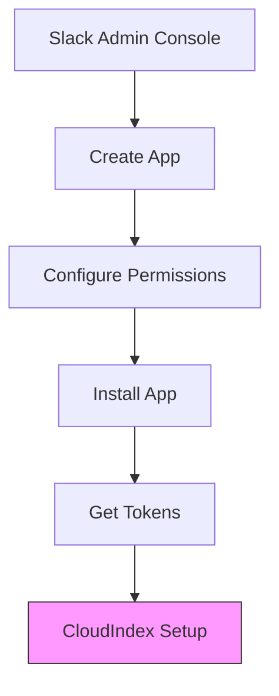

# Slack Integration

Learn how to integrate CloudIndex with Slack to index and search messages, files, and conversations.

## Setup Overview



## Prerequisites

1. **Slack Workspace**
   - Admin access to workspace
   - Permission to install apps
   - Slack App creation rights

2. **CloudIndex Configuration**
   - CloudIndex API key
   - Admin access to your project
   - Webhook endpoint (optional)

## Slack App Setup

### 1. Create Slack App

1. Go to [Slack API Console](https://api.slack.com/apps)
2. Click "Create New App"
3. Choose "From scratch"
4. Configure basic information:
   ```json
   {
     "display_information": {
       "name": "CloudIndex Search",
       "description": "Search your Slack content with CloudIndex",
       "background_color": "#4A154B"
     }
   }
   ```

### 2. Configure OAuth Scopes

Required scopes for the Slack app:

```javascript
const requiredScopes = [
  // Channel access
  'channels:history',
  'channels:read',
  'groups:history',
  'groups:read',
  
  // File access
  'files:read',
  
  // Message access
  'search:read',
  
  // User information
  'users:read',
  'users:read.email'
];
```

## CloudIndex Integration

### 1. Configure Integration

```javascript
import { CloudIndex } from '@cloudindex/sdk';

const cloudindex = new CloudIndex({ apiKey: 'your_api_key' });

await cloudindex.integrations.configure({
  type: 'slack',
  credentials: {
    botToken: process.env.SLACK_BOT_TOKEN,
    appToken: process.env.SLACK_APP_TOKEN,
    signingSecret: process.env.SLACK_SIGNING_SECRET
  },
  settings: {
    channels: ['general', 'engineering', 'support'],
    messageTypes: ['message', 'file_share'],
    fileTypes: ['pdf', 'docx', 'txt'],
    syncInterval: 3600  // 1 hour
  }
});
```

### 2. Event Subscription

```javascript
const eventConfig = {
  events: [
    'message',
    'file_shared',
    'file_created',
    'file_deleted',
    'channel_created',
    'channel_archived'
  ],
  url: 'https://your-app.com/slack/events'
};
```

## Content Processing

### 1. Message Processing

```javascript
class SlackProcessor {
  constructor(config) {
    this.client = new WebClient(config.botToken);
  }

  async processMessage(event) {
    // Extract message content and metadata
    const message = {
      id: event.client_msg_id,
      text: event.text,
      user: event.user,
      channel: event.channel,
      timestamp: event.ts,
      threadTs: event.thread_ts
    };

    // Process mentions and links
    const processed = await this.enrichMessage(message);

    // Index the message
    await cloudindex.documents.upload({
      content: processed.text,
      metadata: {
        source: 'slack',
        type: 'message',
        messageId: processed.id,
        channel: processed.channel,
        user: processed.user,
        timestamp: processed.timestamp,
        thread: processed.threadTs
      }
    });
  }

  async enrichMessage(message) {
    // Resolve user mentions
    message.text = await this.resolveUserMentions(message.text);
    
    // Expand links
    message.text = await this.expandLinks(message.text);
    
    return message;
  }
}
```

### 2. File Processing

```javascript
async function processSlackFile(file) {
  // Download file
  const fileData = await downloadFile(file.url_private, {
    headers: {
      Authorization: `Bearer ${process.env.SLACK_BOT_TOKEN}`
    }
  });

  // Upload to CloudIndex
  await cloudindex.documents.upload({
    file: fileData,
    metadata: {
      source: 'slack',
      type: 'file',
      fileId: file.id,
      fileName: file.name,
      fileType: file.filetype,
      channel: file.channels[0],
      user: file.user,
      timestamp: file.timestamp,
      size: file.size
    }
  });
}
```

## Event Handling

### 1. Message Events

```javascript
async function handleMessageEvent(event) {
  switch (event.type) {
    case 'message':
      await processMessage(event);
      break;
    
    case 'message_changed':
      await updateMessage(event);
      break;
    
    case 'message_deleted':
      await deleteMessage(event);
      break;
  }
}
```

### 2. File Events

```javascript
async function handleFileEvent(event) {
  switch (event.type) {
    case 'file_shared':
    case 'file_created':
      await processFile(event.file);
      break;
    
    case 'file_deleted':
      await deleteFile(event.file_id);
      break;
    
    case 'file_public':
      await updateFileAccess(event.file_id, 'public');
      break;
  }
}
```

## Search Implementation

### 1. Slash Command

```javascript
app.command('/search', async ({ command, ack, respond }) => {
  await ack();

  const results = await cloudindex.search.query({
    query: command.text,
    filter: {
      source: 'slack',
      channel: command.channel_id
    },
    options: {
      limit: 5,
      includeMetadata: true
    }
  });

  await respond({
    blocks: formatSearchResults(results)
  });
});
```

### 2. Result Formatting

```javascript
function formatSearchResults(results) {
  return results.matches.map(result => ({
    type: 'section',
    text: {
      type: 'mrkdwn',
      text: formatResult(result)
    },
    accessory: {
      type: 'button',
      text: {
        type: 'plain_text',
        text: 'View in Slack'
      },
      url: generateSlackUrl(result)
    }
  }));
}
```

## Error Handling

### 1. Common Issues

```javascript
class SlackIntegrationError extends Error {
  constructor(code, message, details) {
    super(message);
    this.code = code;
    this.details = details;
  }
}

async function handleSlackError(error) {
  switch (error.code) {
    case 'token_expired':
      await refreshToken();
      break;
    case 'channel_not_found':
      await handleMissingChannel(error);
      break;
    case 'rate_limited':
      await handleRateLimit(error);
      break;
    default:
      throw new SlackIntegrationError(
        'slack_error',
        'Slack operation failed',
        error
      );
  }
}
```

### 2. Rate Limiting

```javascript
const rateLimiter = {
  maxRequests: 50,
  interval: 60000,  // 1 minute
  queue: [],
  
  async execute(operation) {
    if (this.queue.length >= this.maxRequests) {
      const delay = this.interval - 
        (Date.now() - this.queue[0]);
      await sleep(delay);
      this.queue.shift();
    }
    
    this.queue.push(Date.now());
    return operation();
  }
};
```

## Best Practices

1. **Performance**
   - Batch process messages
   - Implement caching
   - Use cursor pagination
   - Monitor rate limits

2. **Security**
   - Store tokens securely
   - Validate requests
   - Implement timeouts
   - Monitor access

3. **Reliability**
   - Handle disconnections
   - Implement retries
   - Log operations
   - Monitor events

## Next Steps

- [Google Drive Integration](/docs/integrations/google-drive)
- [S3 Integration](/docs/integrations/s3-bucket)
- [Error Handling](/docs/guides/error-handling)
- [Monitoring Guide](/docs/guides/monitoring)
